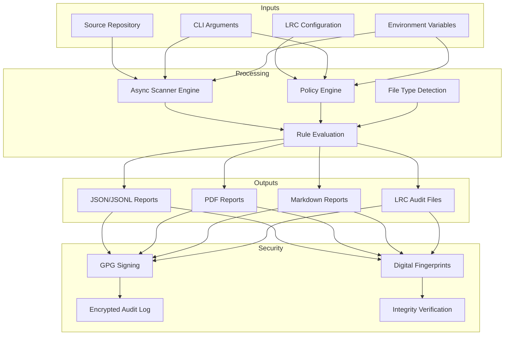

# Dev Audit Tool [DAT]

**Enterprise-Grade Source Code Auditing and Compliance Scanning**

The Dev Audit Tool (DAT) is an enterprise-focused auditing engine that performs comprehensive security, compliance, and code quality analysis of source repositories. Version **v2.0.0-alpha.1** introduces a modern modular architecture with advanced features for secure development workflows across Linux, macOS, Windows, WSL2, and Termux.

## 🚀 Key Features

- **Modular Architecture** - Clean `src/dat` layout with dedicated packages for scanning, reporting, integration, and policy enforcement
- **High-Performance Scanning** - Asynchronous scanning engine optimized for large codebases with configurable safe/deep modes
- **Enterprise Integration** - Native [LRC (License and Regulatory Compliance)](https://github.com/Justadudeinspace/lrc) schema ingestion for policy-as-code
- **Comprehensive Reporting** - Standardized JSONL, JSON, Markdown, and PDF outputs with cryptographic fingerprints
- **Security-First Design** - GPG artifact signing with automatic SHA256 fallbacks and encrypted audit logging
- **Developer Experience** - Rich interactive CLI with color-coded outputs, progress tracking, and intuitive flag sets
- **Cross-Platform Support** - Consistent behavior across Linux, macOS, Windows, WSL2, and Android (Termux)

## 📊 Architecture Overview



## 🏁 Quick Start

### Installation

```bash
# Clone and install with development dependencies
git clone https://github.com/Justadudeinspace/dat.git
cd dat
pip install -e .

# Or use the automated bootstrap script (recommended)
chmod +x install_deps.sh
./install_deps.sh

# Verify installation
dat --version
```

### Basic Usage

```bash
# Safe scan with JSON report (recommended for development)
dat . --safe --report audit.json

# Comprehensive security audit with PDF output
dat . --deep --output audit.pdf --sign

# Enterprise scan with LRC integration
dat . --from-lrc --report audit.json --output audit.pdf --verbose

# Quick security assessment
dat . --fast --markdown security-scan.md
```

## 🎯 CLI Reference

### Core Commands
```
# Command Description
dat [PATH] Scan repository at PATH (default: current directory)
dat --version Display DAT version and build information
dat --help Show comprehensive help message
```
### Scanning Modes
```
# Flag Description Default
--safe, -s Enable safe scanning (skip large/binary files) enabled
--no-safe Disable safe scanning limitations false
--deep, -p Perform deep scan including binary analysis false
--fast Optimized scanning for speed false
--audit Compliance audit mode false
--max-lines N Maximum lines per file in safe mode 1000
--max-size N Maximum file size in bytes in safe mode 10MB
```
### File Management
```
# Flag Description
-i, --ignore PATTERN Exclude files matching glob pattern (repeatable)
--ignore-file PATH Read ignore patterns from file
-f, --folder PATH Scan only specific folder
-s, --single-file FILE Scan only specific file
-a, --all Include hidden files and directories
```
### Output Formats
```
# Flag Description Format
-o, --output PATH Write report (auto-detects format from extension) Auto
--report PATH Alias for --output Auto
--json PATH Write JSON report JSON
--jsonl PATH Write JSON Lines report JSONL
--pdf PATH Write PDF report PDF
--md, --markdown PATH Write Markdown report Markdown
```
### Enterprise Features
```
# Flag Description
--from-lrc [PATH] Enable LRC integration (auto-detects config)
--sign Sign artifacts with GPG
--no-sign Disable artifact signing
--interactive Enable interactive confirmation prompts
--diff BASELINE Compare against previous scan report
--compliance FRAMEWORKS Specific compliance frameworks (soc2,gdpr,hipaa)
```
### Analysis & Debugging
```
# Flag Description
-v, --verbose Enable detailed progress output
--debug Enable debug-level logging
--stats Show detailed statistics
--profile Profile scanning performance
--validate-config Validate configuration without scanning
```
# 🔧 LRC Integration

DAT provides seamless integration with LRC (License and Regulatory Compliance) build pipelines for enterprise environments. LRC provides a standardized framework for policy-as-code and compliance automation.

## Basic Configuration

### Create LRC configuration:

```bash
mkdir -p ~/.config/lrc
cat > ~/.config/lrc/dat_integration.json << 'EOF'
{
  "policy": {
    "require_signing": true,
    "max_critical_violations": 0,
    "audit_retention_days": 90
  },
  "schemas": [
    {
      "repos": ["my-project", "enterprise-.*"],
      "owner": "security-team@company.com",
      "compliance": ["soc2", "gdpr"],
      "rules": [
        {
          "id": "security.no-secrets",
          "patterns": ["API_KEY", "SECRET_", "PASSWORD="],
          "severity": "critical",
          "description": "Hardcoded credentials detected"
        }
      ]
    }
  ]
}
EOF
```

## Repository Metadata

### Add build context to your repository:

```json
// .lrc-build.json
{
  "project": "production-service",
  "version": "2.1.0",
  "build_id": "build-20240525-001",
  "commit_hash": "a1b2c3d4e5",
  "branch": "main",
  "compiled_at": "2024-05-25T10:30:00Z",
  "artifacts": ["app.jar", "config.yaml"],
  "environment": "production"
}
```

### Enterprise Scan

```bash
# Full enterprise workflow
dat . --from-lrc --report audit.json --output compliance.pdf --sign --verbose

# Compliance framework validation
dat . --from-lrc --compliance soc2,gdpr --json compliance-scan.json

# Evidence collection for audits
dat . --from-lrc --bundle-evidence --output-dir ./compliance-evidence
```

## 📊 Output Formats

### JSON/JSONL Reports

· Deterministic - Consistent output for CI/CD pipelines with sorted keys
· Machine-readable - Structured data for automated processing and integration
· Comprehensive - Full scan metadata, violations, file statistics, and compliance status
· Fingerprinted - SHA256 hash for integrity verification and tamper detection
· Streaming-ready - JSONL format supports real-time processing of large scans

### PDF Reports

· Professional - Print-ready compliance documentation with corporate branding
· Styled - Consistent typography with DejaVu Sans Mono/Courier fallbacks
· Comprehensive - Executive summary and detailed findings with severity color coding
· Brandable - Custom headers, organization metadata, and theme support
· Signed - GPG signatures for authenticity and non-repudiation

### Markdown Reports

· Human-readable - Perfect for pull requests, code reviews, and team collaboration
· GitHub-friendly - Renders beautifully in GitHub/GitLab and chat platforms
· Concise - Focused summary of critical findings and actionable recommendations
· Integration-ready - Easy to pipe into notification systems and documentation

## 🔒 Security Features

### Artifact Signing

```bash
# Generate signed reports
dat . --sign --report audit.json

# Verify signatures
gpg --verify audit.json.asc audit.json

# Key management
export DAT_SIGNING_KEY=YOUR_KEY_ID
dat . --sign --pdf report.pdf
```

### Encrypted Audit Logging

· Automatic - Every scan is logged to ~/.config/dat/auditlog.jsonl
· Encrypted - Fernet encryption with auto-generated and rotated keys
· Tamper-evident - Cryptographic integrity protection with hash chains
· Access-controlled - File permissions restrict access to audit trails
· Compliant - Meets regulatory requirements for audit trail retention

### Digital Fingerprints

· Repository fingerprint - Unique hash identifying the codebase state and content
· Report fingerprint - Integrity verification for generated artifacts and evidence
· Audit trail - Complete chain of custody for compliance and forensic analysis
· Verification - Cryptographic proof of scan authenticity and result integrity

## 🛠️ Advanced Usage

### CI/CD Integration

```yaml
# GitHub Actions example
- name: Security Audit
  run: |
    dat . --from-lrc --report audit.json --diff baseline.json
    if [ $? -eq 3 ]; then
      echo "New violations detected - failing build"
      exit 1
    fi

# GitLab CI example
security_scan:
  variables:
    DAT_SIGNING_KEY: "${GPG_KEY_ID}"
    LRC_CONFIG_PATH: ".gitlab/lrc-config.json"
  script:
    - dat . --from-lrc --json gl-sast-report.json --sign
  artifacts:
    reports:
      sast: gl-sast-report.json
```

### Performance Optimization

```bash
# For very large repositories
dat . --deep --max-size 52428800 --max-lines 5000 --batch-size 1000 --parallel-threads 8

# Focus on specific file types
dat . --include "*.py" --include "*.js" --include "*.yaml" --code --config

# Exclude generated assets
dat . --ignore "node_modules/" --ignore "dist/" --ignore "*.min.*" --ignore "**/__pycache__/**"

# Memory-constrained environments
dat . --max-memory 1024 --batch-size 500 --fast
```

### Custom Rule Development

```json
{
  "rules": [
    {
      "id": "custom.license-header",
      "patterns": ["Copyright 2024", "MIT License"],
      "severity": "info",
      "description": "License header check",
      "category": "compliance"
    },
    {
      "id": "security.api-endpoints",
      "patterns": ["/api/v[0-9]+/", "endpoint.*="],
      "severity": "medium",
      "description": "API endpoint detection",
      "category": "security"
    }
  ]
}
```

### LRC Policy Integration

```json
{
  "schemas": [
    {
      "repos": ["production-.*"],
      "owner": "security-team",
      "compliance": ["soc2", "gdpr"],
      "rules": [
        {
          "id": "lrc.production.secrets",
          "patterns": [".*SECRET.*", ".*PASSWORD.*", ".*KEY.*"],
          "severity": "critical",
          "description": "Production secrets detection",
          "remediation": "Use secure secret management system"
        }
      ]
    }
  ]
}
```

# 🐛 Troubleshooting

## Common Issues

### Binary Detection Problems

```bash
# Install libmagic for improved file type detection
sudo apt-get install libmagic1  # Ubuntu/Debian
brew install libmagic           # macOS
pkg install libmagic            # Termux

# Use fallback mode
dat . --no-magic

# Check file detection
file --mime-type some-file.py
python -c "import magic; print(magic.from_file('some-file.py'))"
```

### GPG Signing Failures

```bash
# Check GPG installation and configuration
gpg --list-secret-keys
export DAT_SIGNING_KEY=YOUR_KEY_ID

# Disable signing if not required
dat . --no-sign --report audit.json

# Test GPG independently
echo "test" | gpg --clearsign
```

### Performance Issues

```bash
# Reduce parallelism for resource-constrained environments
dat . --parallel-threads 2 --batch-size 500

# Limit memory usage
dat . --max-memory 2048

# Use fast mode for quick scans
dat . --fast --max-size 5242880 --max-lines 2000
```

### LRC Configuration Issues

```bash
# Validate LRC configuration
dat . --from-lrc --validate-config

# Debug LRC integration
DAT_DEBUG=1 dat . --from-lrc --verbose

# Check LRC file locations
ls -la ~/.config/lrc/
ls -la .lrc-build.json
```

### Debug Mode

```bash
# Enable detailed debugging
DAT_DEBUG=1 dat . --verbose --debug

# Profile performance
dat . --profile --report profile.json

# Configuration debugging
dat --show-config --validate-config
```

## 📚 Documentation

### Comprehensive documentation is available in the docs/ directory:

· Usage Guide - Complete CLI reference and practical examples
· Configuration Guide - Enterprise configuration management
· LRC Integration - LRC policy management and compliance
· Output Formats - Report specifications and examples
· GPG Signing - Cryptographic signing guide and key management
· CI/CD Integration - Pipeline examples and best practices
· Rule Development - Custom rule creation and management
· Troubleshooting - Problem-solving and debugging guide
· Enterprise Features - Advanced enterprise capabilities

## 🧪 Development

### Testing

```bash
# Run test suite
pytest

# With coverage reporting
pytest --cov=dat --cov-report=html

# Run specific test categories
pytest tests/test_scanner.py -v
pytest tests/test_integration.py -v
pytest tests/test_lrc_integration.py -v
```

### Code Quality

```bash
# Type checking
mypy src/dat

# Code formatting
black src/dat tests

# Import sorting
isort src/dat tests

# Linting
flake8 src/dat tests
pylint src/dat
```

### Building and Distribution

```bash
# Build package
python -m build

# Run tox matrix
tox

# Create development environment
python -m venv venv
source venv/bin/activate  # Linux/macOS
venv\Scripts\activate     # Windows

# Install with development dependencies
pip install -e .[dev]
```

## 🤝 Contributing

### We welcome contributions! Please see our Contributing Guide for details on:

· Code style and standards (PEP 8, type annotations, docstrings)
· Testing requirements (pytest, coverage, integration tests)
· Pull request process (fork, branch, test, submit)
· Issue reporting (bug reports, feature requests)

### Contribution Areas

· Core Engine: Performance optimization, new scanning capabilities
· Integrations: CI/CD platforms, security tools, LRC enhancements
· Documentation: Tutorials, best practices, case studies
· Testing: Test cases, performance benchmarks, security validation

## 📄 Licensing

DAT is distributed under the MIT License. See [LICENSE](./LICENSE) for complete details.

## 🆘 Support

· Documentation: Full documentation available in docs/ directory
· Issues: Report bugs and feature requests via GitHub Issues
· Discussions: Join community discussions for help and ideas
· LRC Project: Learn about the License and Regulatory Compliance framework
· Enterprise Support: Available for organizations with compliance requirements

---

DAT · Enterprise Security Scanning · v2.0.0-alpha.1
Built with 🔒 security-first principles and 🤖 AI-assisted development

---
